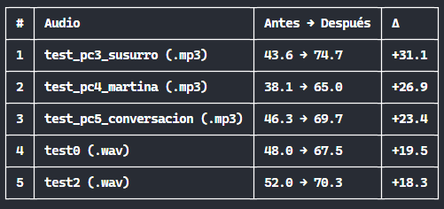
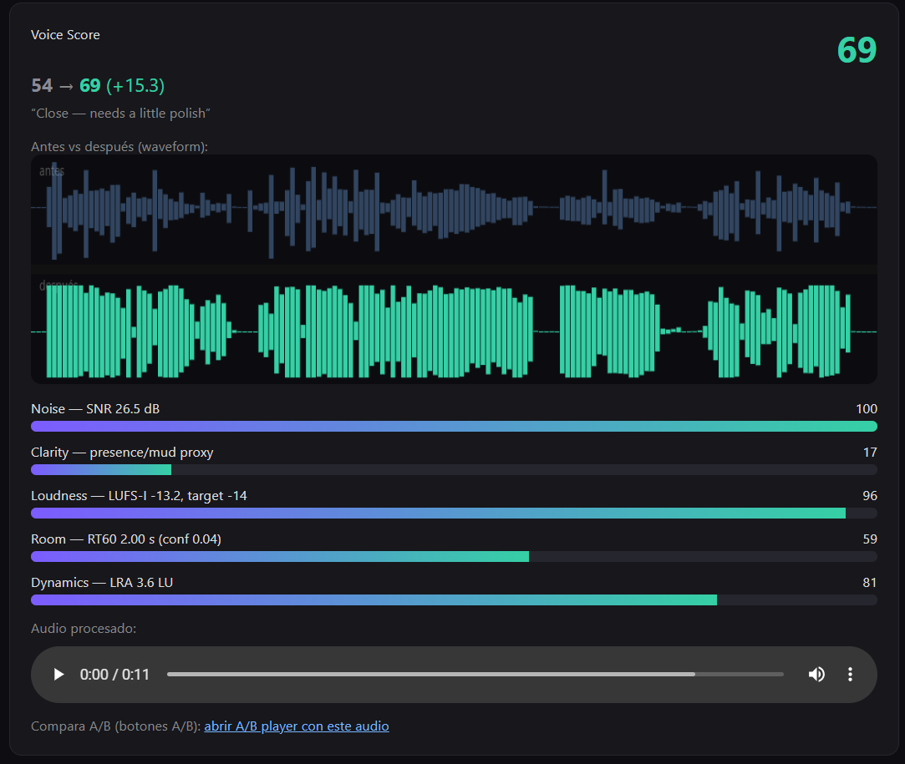
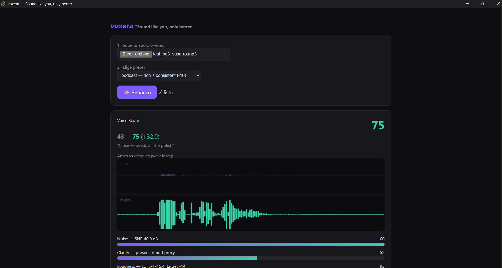
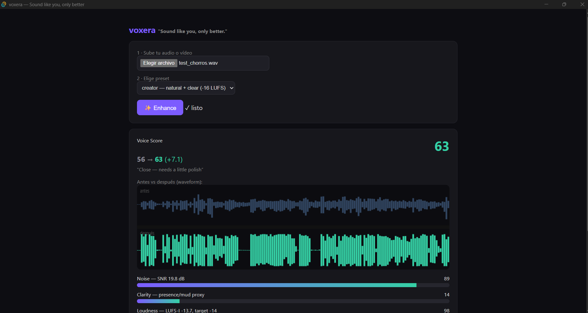

# voxera

Voice/podcast post-production CLI (`voxera`) powered by pluggable neural backends.
Brand: **aintonio.dev | Antonio Gómez** — an AI Engineer's 30-day content challenge product.

> Tagline: **"Sound like you, only better."** — phase 1 = denoiser; phase 2 = *"haz que mi voz
> grabada suene como una voz profesional de vídeo"* (denoiser → analyzer + voice mastering).

## Demo (40 s)

<div align="center">
  <video src="media/demo-video.mp4" controls poster="media/demo-poster.png" width="100%"></video>
  <p><em>Si el vídeo no se reproduce aquí: <a href="media/demo-video.mp4">descargar demo.mp4</a> ·
  fuente en <code>voxera-demo/</code> (Remotion, voz Piper ES, audio real antes/después)</em></p>
</div>

## Capturas

<div align="center">
  
  
</div>
<div align="center">
  
  
</div>

## Quickstart

```bash
# env (Python 3.11)
uv venv --python 3.11 .venv-ims && uv pip install -p .venv-ims -e .

# enhance (NN backend only — back-compat)
.venv-ims/Scripts/voxera enhance in.wav -o out.wav   # default backend (deepfilternet, Pareto winner)

# enhance + voice master pipeline (fase 2): NN SIEMPRE + DSP completo
.venv-ims/Scripts/voxera enhance in.wav -o out.wav --preset creator    # preset por defecto
.venv-ims/Scripts/voxera enhance in.wav -o out.wav --preset youtube --dry-run   # plan sin procesar

# voice mastering ONLY (sin red neuronal)
.venv-ims/Scripts/voxera master in.wav -o out.wav --preset youtube

# analyze (nunca modifica audio)
.venv-ims/Scripts/voxera analyze in.wav                       # resumen TTY
.venv-ims/Scripts/voxera analyze in.wav --format json -o report.json

# tune the backend (fase 1)
.venv-ims/Scripts/voxera enhance in.wav -o out.wav --backend dpdfnet --model dpdfnet2 --attn-limit-db 24
```

## Vídeo (fase 3) — mejora de vídeo vertical 9:16

Mejora vídeos verticales (TikTok/Reels/Shorts): limpia compresión, upscala a
**1080×1920 @30 fps** y remuxea el audio. Requiere **GPU NVIDIA (CUDA)** — CPU
medido a ~67× más lento que realtime, no soportado.

```bash
# env (Python 3.11, CUDA)
uv venv --python 3.11 .venv-video
uv pip install -p .venv-video torch torchvision torchaudio --index-url https://download.pytorch.org/whl/cu121
uv pip install -p .venv-video -e ".[video]"
uv pip uninstall -p .venv-video webrtcvad   # paquete fuente roto en Windows; queda webrtcvad-wheels

# pesos (models/ está en .gitignore; descarga manual una vez)
mkdir -p models/video
curl -L --fail -o models/video/realesr-animevideov3.pth https://github.com/xinntao/Real-ESRGAN/releases/download/v0.2.5.0/realesr-animevideov3.pth
curl -L --fail -o models/video/RealESRGAN_x4plus.pth https://github.com/xinntao/Real-ESRGAN/releases/download/v0.1.0/RealESRGAN_x4plus.pth

# uso
.venv-video/Scripts/voxera video info in.mp4                                # probe JSON
.venv-video/Scripts/voxera video enhance in.mp4 -o out.mp4                  # default: animevideov3 → 1080x1920@30
.venv-video/Scripts/voxera video enhance in.mp4 -o out.mp4 --master-audio   # + voz masterizada (creator)
.venv-video/Scripts/voxera video enhance in.mp4 -o out.mp4 --model x4plus   # escape "natural" (~10x más lento)
.venv-video/Scripts/voxera video enhance in.mp4 -o out.mp4 --dry-run        # plan, no escribe nada
.venv-video/Scripts/voxera video compare a.mp4 b.mp4 -o ab.mp4 --source orig.mp4   # A/B 3 paneles
.venv-video/Scripts/voxera video zoom in.mp4 -o out.mp4 --anchor 0.5,0.33              # zoom Grow (ffmpeg, sin GPU)
.venv-video/Scripts/voxera video magnify in.mp4 -o out.mp4 --center 0.5,0.4           # lente Magnify (ffmpeg, sin GPU)
.venv-ims/Scripts/voxera audio lowpass in.wav -o out.wav --start 4 --end 12           # efecto Pase Bajo (numpy/scipy)
```

### Zoom 

- **Modelo default: `animevideov3`** — decisión AB humana en vídeo (2026-08-12): gana en calidad
  percibida en dos contenidos (talking-head y walking/animación) y es ~7-10× más rápido.
  `--model x4plus` = más textura real, ~10× más lento.
- **Tiempos medidos (RTX 2060 6 GB, tile=512, fp16):** animevideov3 0.85 fps @720p / 0.39 @1080p;
  x4plus 0.12 / 0.04. ≈1 h de cómputo por minuto de vídeo (animevideov3, 30 fps). Throttling
  térmico tras ~1 h continua (~-25%).
- **Web UI:** `.venv-video/Scripts/python.exe ui/server.py` → http://127.0.0.1:8770/video.html
  (upload → job asíncrono → progreso → descarga + still antes/después).
- **Spec completa:** `docs/SPECS-fase3-video.md`.

### Zoom "Grow" (sin Premiere)

Replicación del truco del tutorial de @serri.mp4 (medido frame a frame en el
propio vídeo: zoom 1.0 → 1.40 en ~4 s con curva S, ancla en el sujeto, y
shrink 1.0 → 0.77): zoom con **curva de easing** + **punto de anclaje**,
ampliar y/o reducir. `voxera video zoom` es 100 % ffmpeg (motor zoompan,
canvas supersampled) — sin GPU, sin Premiere, sin keyframes a mano.

```bash
.venv-video/Scripts/voxera video zoom in.mp4 -o out.mp4 \
    --pct 30 --anchor 0.5,0.33 --curve 62 --dir pulse

# criterio automático: picos de energía de la voz (recomendado)
.venv-video/Scripts/voxera video zoom in.mp4 -o out.mp4 \
    --pct 30 --anchor 0.5,0.33 --dir pulse --auto-emphasis \
    --pulse-dur 3 --max-pulses 4
```

- `--dir grow|shrink|pulse` — ampliar, reducir (ventana negra), o ampliar y
  reducir (default grow). `--pct` — % de zoom (default 40, como la demo del
  tutorial; 12 % en 55 s es invisible). `--hold` — fracción en el pico.
- `--anchor X,Y` — punto que queda **fijo en pantalla** mientras la imagen
  crece/encoge alrededor (semántica Premiere; talking-head ≈ `0.5,0.33`).
- `--curve` 0-100 — fuerza del easing (default 62 — el rango 60-65 del
  tutorial; 0 = lineal). `--easing smooth|out|in|linear`.
- `--auto-emphasis` — detecta picos de energía de la voz (envolvente RMS,
  centroide de regiones) y aplica un pulso en cada momento.
- `--start/--end` — segmento. `--dry-run` — plan sin escribir.
- Ejemplo real: `media/videos/zoomed/long1_growzoom.mp4` (+30 %, ancla cara,
  curva 62, pulse, auto-emphasis en t = 1.18/20.68/30.76/38.63 s sobre
  `long1_enhanced.mp4`); verificado por SSIM 0.997 contra el window teórico
  en los picos y 1.000 en las líneas base. Con la voz filtrada en dos frases
  (efecto Pase Bajo): `long1_growzoom_lowpass.mp4` (mismo video, audio
  procesado).

### Lente "Magnify" (sin Premiere)

Replicación del efecto "Magnify" de Adobe Premiere Pro 26.3 (tutorial de
@billycreative_): una lente circular que amplía la zona que hay debajo,
como una lupa al enseñar un paper. Medido en el propio tutorial (anillo
circular detectado por Hough + continuidad de borde en 720x1280): radio
~0.35 del ancho, borde nítido, mitad superior del frame. `voxera video
magnify` es 100 % ffmpeg + dos PNG en gris (máscara con pluma y aro)
generados con numpy — sin GPU, sin Premiere, sin keyframes.

```bash
.venv-video/Scripts/voxera video magnify in.mp4 -o out.mp4 \
    --center 0.5,0.4 --size 0.35 --zoom 3
```

- **La lente se mueve por la escena** (default `--motion auto`): los
  movimientos se disparan con los picos de energía de la voz (misma
  envolvente RMS que `video zoom`) y, si no hay voz, barrido automático por
  celdas con pausa en cada zona. `scan` = barrido puro; `voice` = solo con
  voz (error si no detecta); `static` = lente quieta.
- `--grid COLSxROWS` — celdas del barrido en orden de lectura (default
  2x2, máx 6). `--hold` — pausa por celda en s (default 2.5).
  `--move-dur` — transición entre celdas en s (default 1.2, curva S).
  `--min-gap` — separación mínima entre momentos de voz (default 3).
- **Calidad** (prioridad del usuario): el pipeline trabaja TODO en YUV sin
  conversiones RGB — la máscara circular se aplica con `maskedmerge`
  (blend lineal por luma) — y el upscale del patch es lanczos + unsharp
  leve (`--sharpen`, default 0.5; 0 = sin). Fuera de la lente el frame
  queda intacto (verificado: diff media 0.35-0.9 en vídeo real).
- `--center X,Y` (solo static) · `--size` (default 0.35) · `--zoom`
  (default 3) · `--feather` (default 0.05) · `--ring-width` (default
  0.025) · `--start/--end` · `--dry-run`.
- Ejemplos: `media/videos/magnified/paper_magnify_motion.mp4` (paper
  sintético, barrido 2x2) y `tutorial_magnify_voice.mp4` (lente movida por
  la voz sobre el propio tutorial, segmento 21-31 s).

### Efecto "Pase Bajo" de audio (sin Premiere)

Replicación del efecto "Pase Bajo" del tutorial de @serri.mp4 (medido en el
propio audio del tutorial, extraído vía CDP: cutoff 800 Hz declarado
—"ajustaremos el valor a 800 hercios"—, transición predeterminada de
Premiere (Constant Power, ~1 s) en los cortes, pendiente ~12 dB/oct):
filtra las frecuencias agudas del clip con **rampas suaves** en los bordes
para que el cambio no sea brusco. `voxera audio lowpass` es 100 %
numpy/scipy — sin Premiere, sin keyframes a mano.

```bash
.venv-ims/Scripts/voxera audio lowpass in.wav -o out.wav \
    --start 4 --end 12              # el caso del tutorial: rampa de entrada,
                                    # mantener, rampa de salida ("blip")
.venv-ims/Scripts/voxera audio lowpass in.wav -o out.wav   # todo el clip
```

- `--cutoff` — frecuencia de corte en Hz (default 800, la del tutorial).
- `--start/--end` — región filtrada; con ambos = blip (el caso del tutorial:
  el segmento entre los dos cortes); solo `--start` = el filtro entra y se
  queda; solo `--end` = empieza filtrado y se suelta.
- `--transition` — duración de la rampa en cada borde en s (default 1 — la
  "transición predeterminada" de Premiere; 0 = cambio brusco).
- `--curve` 0-100 — fuerza del easing (default 62 — el rango 60-65 del
  creador, misma convención que `video zoom`; 0 = lineal).
- `--order` 1|2|4 — orden del filtro (default 2, ~12 dB/oct medido; 1 = 6
  dB/oct, 4 = 24 dB/oct). `--dry-run` — plan sin escribir.
- Ejemplo real: `media/audio/lowpass/demo_blip.wav` (blip 4-12 s sobre el
audio del tutorial de zoom); verificado: bit-exacto fuera de la región,
-27.8 dB en la banda 3-9 kHz dentro (teoría butter2@800), bajo preservado
(-0.1 dB) y rampas S con correlación 0.999 (método ratio out/in).
- Ejemplo combinado zoom + voz lowpass:
  `media/videos/zoomed/long1_growzoom_lowpass.mp4` — el growzoom de long1 con
  dos frases de la voz filtradas a 800 Hz (30.1-35.6 s y 38.2-43.4 s,
  transición 0.5 s), coincidiendo con los pulsos de zoom en t=30.76 y
  38.63 s para ver/oir los dos efectos a la vez; verificado bit-exacto fuera
  de las regiones y -26 dB en 3-9 kHz dentro (la frase 2 es "Otra de las
  cosas...", t=38.3-43.3 s).

### Skills del agente (conocimiento procedural)

Cómo se midieron los efectos, criterios de auto-aplicación, trampas de
ffmpeg/TikTok y verificación numérica: `docs/skills/` (mirror en repo de los
skills del agente).

## Comandos (Track 1, spec fase 2)

| Comando | Qué hace |
|---|---|
| `voxera enhance IN -o OUT [--preset X]` | Restoration + voice mastering: backend NN + pipeline DSP completo. `--preset` **siempre** ejecuta el pipeline (default `creator`); sin flag = solo backend (back-compat). |
| `voxera enhance IN -o OUT --dsp-only` | Pipeline sin red neuronal (master puro). |
| `voxera enhance IN -o OUT --dry-run` | Plan `VOXERA PLAN` sin escribir OUT ni cargar la NN. |
| `voxera master IN -o OUT [--preset X]` | Voice mastering ONLY: DC → high-pass LR24 → [dehum] → EQ vocal → de-esser → comp → limiter -1 dBTP → loudnorm. |
| `voxera analyze IN [--format tty\|json] [-o report.json]` | Análisis completo con confidence: LUFS-I/S/LRA/RMS/TP, VAD, SNR, bandas espectrales, hum 50/100/150, RT60, DC, plosives, breaths, mouth clicks, noise type. |
| `voxera score IN [--ref ORIG]` | Voice Score CVS 0-100 (Noise/Clarity/Loudness/Room/Dynamics) + veredicto; `--ref` → Voice Preservation % (resemblyzer). |
| `voxera silence IN -o OUT --level L [--breaths preserve\|attenuate\|remove] [--declick]` | Recorta silencios sin cortar respiraciones; reporta `original → cleaned`. |
| `voxera restore IN -o OUT [--declip] [--deplosive] [--dehum N] [--preset X]` | Restoration heurística: flat-tops, plosives, hum + master opcional. |
| `voxera inspect IN` | `analyze` + recomendación (dehum/declick/restore/preset). |
| `voxera enhance video.mp4 -o out.mp4 --preset X` | Vídeo directo: extrae audio → pipeline → mux (`-c:v copy` + AAC 192k, drift ≤10 ms). |

**Presets congelados:** `creator` (-16 LUFS, natural+clear, default) · `youtube` (-14, warm+present) ·
`podcast` (-16, rich+consistent) · `social` (-14, loud+punchy) · `bad-room` (-16, high-pass 90 Hz).

**Exit codes:** `0` OK · `1` error de procesamiento · `2` error de uso/backend desconocido ·
`20` `VOXERA_NO_SPEECH` (VAD speech ratio < 5%; `analyze` sigue funcionando).

**Política de formatos (congelada, Track 1A):** input WAV 16/22.05/44.1/48 kHz mono/stereo →
interno **48 kHz mono** (downmix energía `0.5·(L+R)`, resample soxr) → salida **WAV PCM 24-bit**.
Determinismo: DSP byte-equivalente; JSON de reports estable para CI (claves ordenadas, floats fijos,
única excepción `processing_time_s`). Device: `--device auto|cpu|cuda`; `--seed N` para la NN.

## Backends (pluggable, metric-driven)

| Backend | Runtime | GPU | Status | Pareto (pesq / rtf) |
|---|---|---|---|---|
| `deepfilternet` | Python (`df`+torch) / Rust bin | ✅ CUDA torch auto | ✅ **DEFAULT (ganador)** | **DeepFilterNet2 pf=off: 3.28 / 0.08** |
| `dpdfnet` | ONNX (real-time CPU) | ✅ vía `onnxruntime-gpu` (CUDA) | ✅ disponible | dpdfnet2@attn24: 2.88 / 0.38 |
| `resemble` | offline diffusion | ✅ CUDA recomendado (lento en CPU) | ⚠️ evaluado, rinde peor en PESQ | full: 1.74 @ rtf 12.8 · denoise_only: 2.24 @ 0.71 |

**GPU está soportado.** Esta máquina tiene una NVIDIA RTX 2060 6GB (torch CUDA 2.11). Los backends
usan CUDA donde esté disponible; el CLI usa `--device auto` (CUDA si hay, si no CPU).

Model/param selection is **empirical** (Pareto quality-vs-RTF on an ES+EN benchmark set), never
assumed — see `.auto/` (autoresearch).

## Architecture

```
src/voxera/   enhance() contract, backend registry, audioio (policy), dsp/ (pipeline+presets),
              analyze.py, master.py, vad.py, device.py, determinism.py, CLI,
              video_enhance.py (fase 3: Real-ESRGAN CUDA)
features/     Gherkin: enhance-cli (10 escenarios), master-cli (5), analyze-cli (3)
acceptance/   APS Gherkin acceptance pipeline (parse→dry-check→generate→run)
tests/        195+ pytest unit tests (tracks 0-5 + fase 1 + video_enhance)
ui/           UI thin (index + A/B player + video.html + server.py: /enhance /score /vote /api/video)
.auto/v2/     benchmark v2: synthetic + real separados (reports/*.md)
swarmforge/   SwarmForge four-pack (specifier→coder→refactorer→architect)
.auto/        autoresearch harness (gitignored): measure.py, candidate.json, log.jsonl
```

- **Core is the source of truth** — everything is drivable from the terminal (premise: the agent can edit/run/tweak everything).
- Desktop (Tauri) shell planned (Track 7), wrapping the CLI as a sidecar — the Rust `deep-filter` binary is the natural fit.

## Status

- **Fase 1** (`voxera enhance` happy-path CLI): ✅ complete — 70 tests, exit codes per spec.
- **Model selection**: ✅ autoresearch verdict — **DeepFilterNet2 (pf=off) is the default**.
- **Fase 2 — Track 0 (rename)**: ✅ `improve_my_sound`/`ims` → `voxera`.
- **Fase 2 — Tracks 1A/1/1B (fundaciones + analyze/master)**: ✅ formatos, determinismo, device,
  RTF, provenance, exit 20, presets, de-esser no-daño, heurísticas de voz.
- **Fase 2 — Tracks 2/3/4/5**: ✅ `silence` (gaps+breaths+declick), `score` (CVS + voz preservada),
  vídeo directo (bit-identical, AAC 192k), `restore` (declip/deplosive/dehum).
- **Fase 2 — Track 6 (benchmark v2)**: ✅ `.auto/v2/` sintético ejecutado (DF2 pesq 3.07);
  suite real esperando clips de Antonio en `.auto/v2/real/`.
- **Fase 2 — Tracks 8/7 (humano + UI)**: ✅ A/B player + votos CSV + protocolo; UI thin en `ui/`
  (servidor 127.0.0.1:8770). Tauri shell pendiente de toolchain Rust.
- **Fase 3 — Vídeo (mejora vertical 9:16)**: ✅ `voxera video info/enhance/compare`, backend
  Real-ESRGAN CUDA (default animevideov3, AB decidido), `--master-audio` (voz voxera + vídeo en
  un comando), web UI con jobs asíncronos, tests 13/13, deliverables en `media/videos/enhanced/`.
- **Pendiente humano**: clips reales (decisión #3) y escucha Track 8 (decisión #12).
  Detalle: `docs/ROADMAP-fase2.md`.

## Operations

- Swarm: `./launch-swarm.sh` (four-pack on orca backend, agents on DeepSeek V4 Flash).
- Stop: `bash swarmforge/scripts/close-swarm.sh`.
- Autoresearch results: `.auto/log.jsonl` (Pareto cloud).
- Acceptance: `bash acceptance/scripts/accept features` (o `python -m acceptance.pipeline features`).
